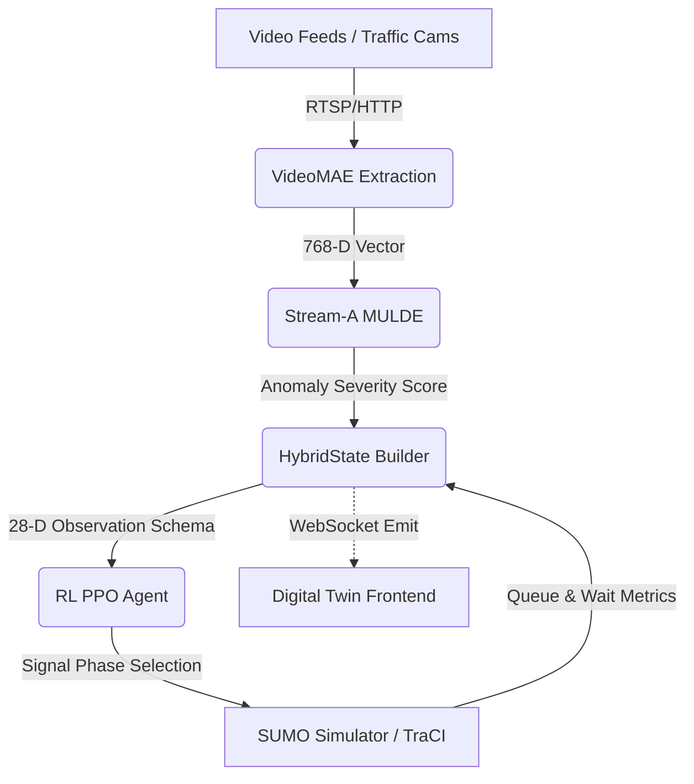

# NEXUS-ATMS Architecture Design

This document details the fully frozen AI logic and data pipeline powering the NEXUS-ATMS platform.

## High-Level Pipeline

## RL Observation Schema (Canonical 28-D)

The entire environment state is flattened into a canonical 28-dimensional vector to support Stable-Baselines3 PPO parameter sharing across varying intersection configurations. 

**Shape:** `(28,)` | **dtype:** `np.float32`

| Index Range | Feature | Description |
| :--- | :--- | :--- |
| `[0:4]` | Local Queue Lengths | Normalized queues for N, S, E, W approaches. |
| `[4]` | Anomaly Severity | **The critical Stream-A severity score [0.0 - 1.0].** Provides early warning of incoming incidents. |
| `[5:9]` | Local Wait Times | Average wait times for N, S, E, W. |
| `[9:13]` | Active Phase | One-hot encoded vector representing the current traffic light phase. |
| `[13]` | Time Since Change | Normalized time since the phase was last switched. |
| `[14:18]` | Neighbor Pressure | Aggregated upstream queue data from 4 adjacent intersections. |
| `[18:28]` | Exogenous Global State | Hour of day (sin/cos), global grid congestion metrics, etc. |

## OpenStreetMap (OSM) Workflow

Rather than synthetic grids, NEXUS-ATMS validates against real-world topologies:
1. `Overpass API` / `api.openstreetmap.org` is queried for an urban bounding box.
2. The `.osm` file is compiled via SUMO `netconvert` with heuristics applied for TLS junction-guessing and roundabout formation.
3. SUMO `randomTrips.py` generates dynamic vehicle flows across the complex map geometry.
4. The RL Orchestrator dynamically enumerates signalized intersections using `traci.trafficlight.getIDList()` and applies the 28-D PPO policy to each independent light.

## Failure Recovery & Fallback

If Stream-A times out (e.g., GPU crash or network partition), the `HybridStateBuilder` injects a synthetic `0.0` severity score into index 4 of the observation vector. 
If the entire Python inference runtime fails, the `Runtime Orchestrator` detaches from SUMO, causing SUMO to automatically resume execution utilizing its default static-actuated phase logic. 
