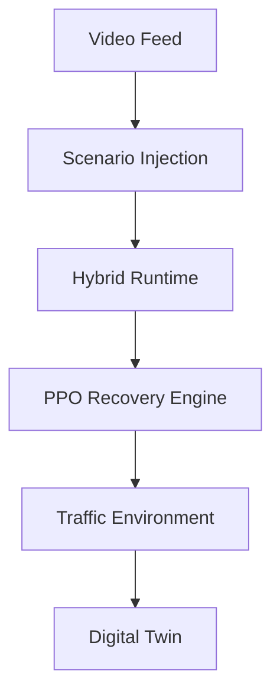
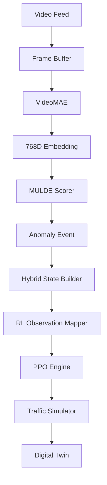

# ArgusFlow
### Vision-Guided Traffic Incident Intelligence & Recovery Platform

Built on top of the NEXUS-ATMS reinforcement learning core, ArgusFlow extends traditional traffic optimization with transformer-based anomaly perception.

NEXUS provides:
• Traffic Environment
• PPO Decision Engine
• Traffic Recovery Logic

ArgusFlow adds:
• VideoMAE Perception Layer
• MULDE Anomaly Scoring
• Incident Severity Modeling
• Digital Twin Command Center

The current hackathon runtime demonstrates the complete recovery loop through controlled anomaly injection, while the repository already contains the VideoMAE and MULDE components required for full end-to-end perception integration.

While traditional traffic systems operate purely on mathematical metrics (queue lengths, wait times), ArgusFlow introduces visual intelligence. It identifies anomalous traffic events directly from video streams and dynamically feeds severity scores into a Reinforcement Learning engine to autonomously recover traffic flow.

---

## Technical Architecture

ArgusFlow is a hybrid architecture uniting Computer Vision (Argus Vision Stack) with Reinforcement Learning (NEXUS Engine).

### The Current Runtime (Mocked Live Integration)
For demonstration and scenario-testing purposes, the live presentation executes the following pathway, where anomalies are injected via the Command Center:



### The Roadmap (Full Technical Reality)
The codebase includes state-of-the-art vision models in `argus_stream_extracted`. The immediate roadmap integrates these directly into the execution loop, removing the need for mock injection:



---

## Running the Platform

ArgusFlow provides a comprehensive Command Center built with Next.js and FastAPI.

### 1. Start the Intelligent Backend
The backend initializes the Hybrid Runtime and the PPO engines.
```bash
python backend/main.py
```

### 2. Start the Command Center
Launch the Next.js Digital Twin and Scenario Studio.
```bash
cd frontend
npm run dev
```

*Navigate to `http://localhost:3000` to interact with the Digital Twin and inject scenarios.*
