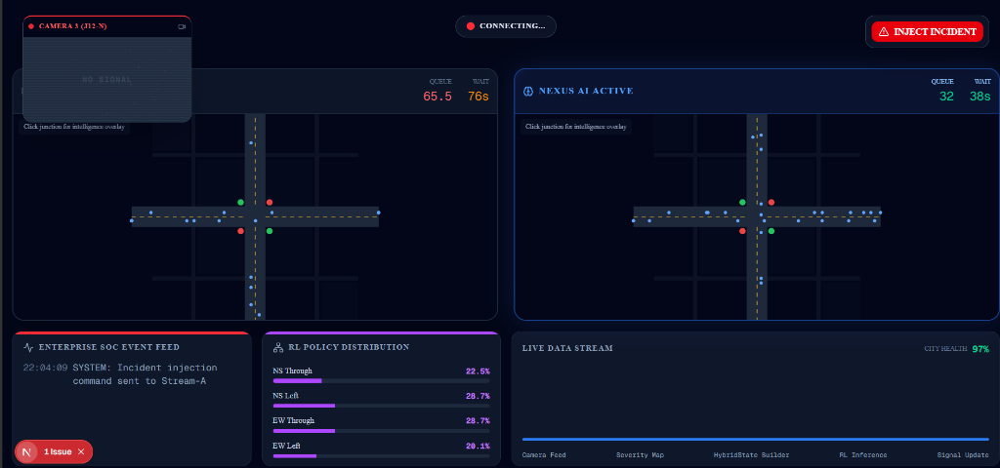
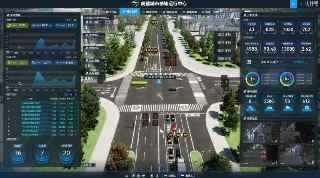
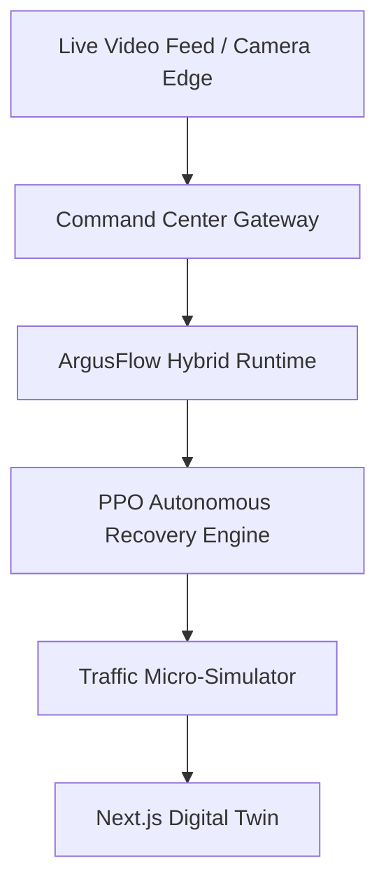

# ArgusFlow

### Vision-Guided Traffic Incident Intelligence & Recovery Platform

## 1. Problem
Urban traffic systems rely on basic mathematical metrics like queue lengths and static timers, making them entirely blind to real-world incidents. When accidents, road maintenance, or severe anomalies occur, traditional networks fail to react, leading to cascading gridlocks. They lack the *visual perception* required to understand context and severity.

## 2. Solution
**ArgusFlow** introduces visual intelligence to traffic optimization. It acts as a Vision-Guided Traffic Incident Intelligence & Recovery Platform. By identifying anomalous traffic events from camera streams and computing severity scores, ArgusFlow dynamically instructs a Deep Reinforcement Learning engine to autonomously adapt signal phases, clear blockages, and recover traffic flow.

## 3. The Core Stack: NEXUS vs ArgusFlow
Built on the NEXUS-ATMS reinforcement learning core, ArgusFlow extends traditional optimization with transformer-based anomaly perception.

**NEXUS provides:**
- PPO traffic optimization
- Traffic state management
- Signal phase control

**ArgusFlow adds:**
- Video anomaly perception
- Severity estimation
- Incident-aware recovery
- Digital Twin command center

## 4. Architecture Diagram


## 5. Demo
🎥 **Video Demo:** [Watch on YouTube](https://youtube.com/unlisted-link)



## 5. Runtime Pipeline
ArgusFlow executes a hybrid pipeline combining Computer Vision (Argus Vision Stack) with Reinforcement Learning (NEXUS Engine):


*(Note: Historical research, legacy models, and raw VideoMAE integration experiments have been moved to `archive/` to keep the production runtime lean and clean).*

## 6. Tech Stack
- **Frontend**: Next.js, React, TailwindCSS, Recharts
- **Backend**: FastAPI, WebSockets, Python
- **Intelligence**: PyTorch (PPO, D3QN), Scikit-Learn
- **Simulation**: Eclipse SUMO (Simulation of Urban MObility)
- **Deployment**: Docker, Docker Compose

## 7. Run Locally
ArgusFlow provides a comprehensive Command Center built with Next.js and FastAPI.

### 1. Start the Intelligent Backend
The backend initializes the Hybrid Runtime, anomaly detectors, and PPO engines.
```bash
python backend/main.py
```

### 2. Start the Command Center
Launch the Next.js Digital Twin and Scenario Studio.
```bash
cd frontend
npm run dev
```
Navigate to `http://localhost:3000` to interact with the Digital Twin and monitor active traffic states.

## 8. Future Work
- **Direct Edge Deployment**: Move the MULDE anomaly scorer directly to edge camera nodes to reduce bandwidth overhead.
- **V2X Integration**: Expand the emergency corridor engine to communicate directly with connected emergency vehicles.
- **Multi-Modal Vision**: Combine infrared and RGB streams for robust nighttime anomaly detection.
