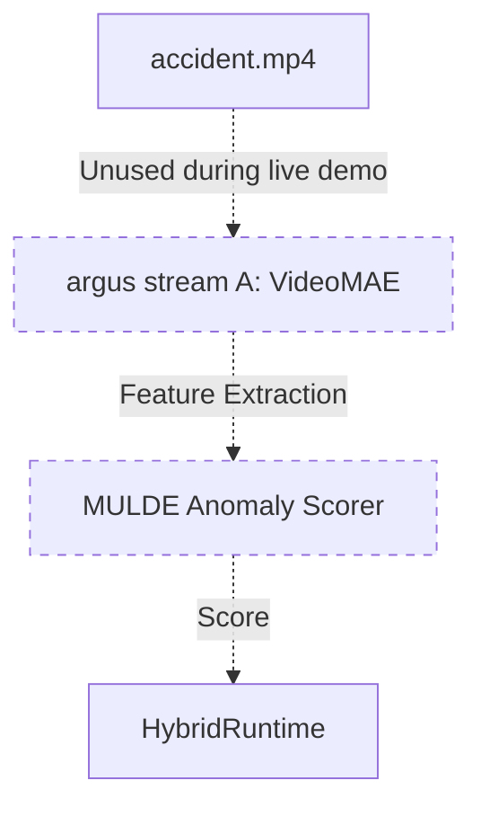

# EVOLUTION FORENSICS AUDIT
## Document 3: DEPENDENCY_GRAPH.md

### System Dependency Graphs

#### 1. Runtime Dependency Graph (Live Hackathon Mode)
This shows how the system executes when a judge is watching.

```mermaid
graph TD
    UI[Frontend: ScenarioStudio.tsx] -->|POST /api/inject| API[Backend: main.py]
    UI -->|Connects to| WS[WebSocket: ws://localhost:8001/ws]
    
    API -->|Instantiates| HR[HybridRuntime]
    HR -->|Queries| RL[PPO Policy]
    HR -->|Updates| TE[TrafficEnvironment (Gym)]
    
    TE -->|Yields State| HR
    RL -->|Yields Action| TE
    
    HR -->|Broadcasts State| WS
    WS -->|Reads Action & Policy| UI_RL[Frontend: AIDecisionEngine.tsx]
```
**Conclusion:** The UI *pushes* the anomaly trigger to the backend, the backend runs the real RL policy, and the UI reads the RL decision back.

#### 2. Model Dependency Graph (Offline Training)
```mermaid
graph TD
    TE[TrafficEnvironment] -->|Obs (28D)| PPO[StableBaselines3 PPO]
    PPO -->|Action (Phase)| TE
    TE -->|Reward| PPO
    
    Train[scripts/train_anomaly_policy.py] -->|Configures| TE
    Train -->|Saves| ZIP[models/anomaly_v4/best_model.zip]
```

#### 3. Computer Vision Dependency Graph (Disjointed)

**Conclusion:** The CV layer is completely isolated from the live runtime graph.

#### 4. File Dependency Graph (Backend Core)
- `backend/main.py`
  - imports `backend/runtime/hybrid_runtime.py`
  - imports `backend/demo_data.py` (when in demo mode)
- `backend/runtime/hybrid_runtime.py`
  - imports `control/traffic_env.py`
  - imports `stable_baselines3.PPO`
- `control/traffic_env.py`
  - Self-contained. Relies only on `numpy` and `gymnasium`.

#### Who is never called?
- The entire `modules/` directory (Emergency, Cybersecurity, Carbon) mentioned in Phase A is orphaned from `hybrid_runtime.py`.
- `argus_stream_extracted/argus stream A/demo.py` is an isolated Gradio app, not integrated into the main FastAPI router.
